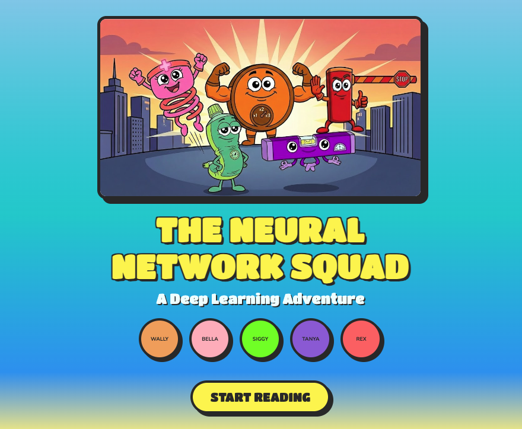
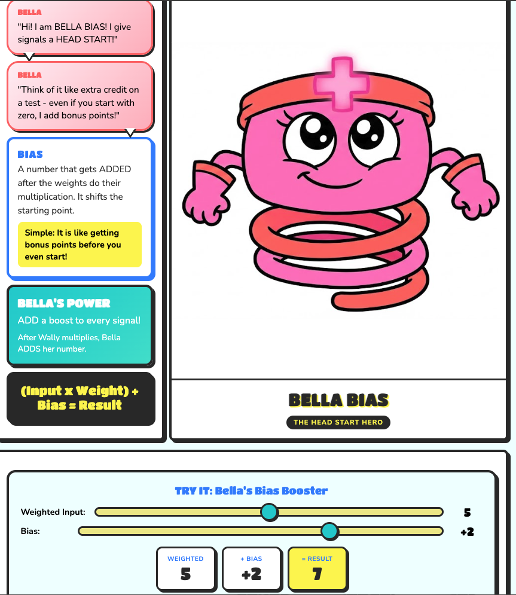
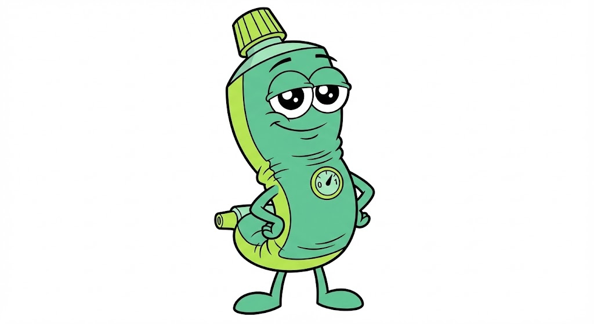
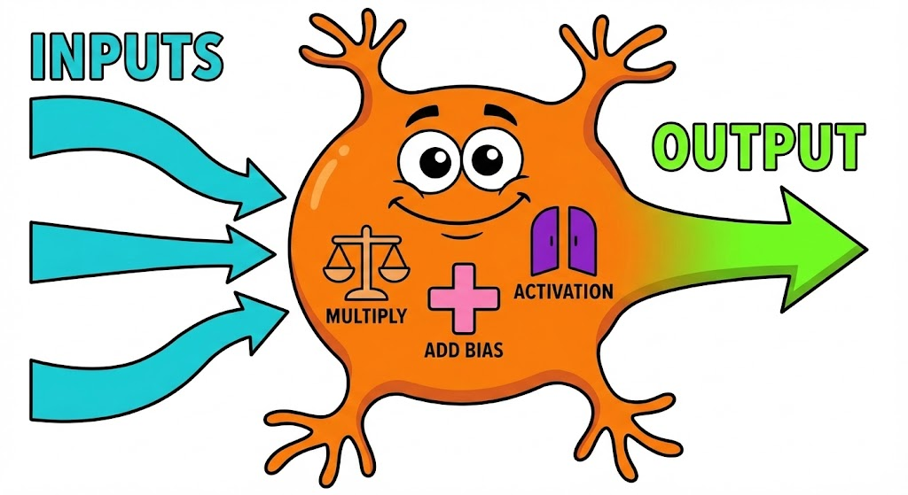

# 🧠 The Neural Network Squad

[](https://developer.mozilla.org/en-US/docs/Web/HTML)
[](https://developer.mozilla.org/en-US/docs/Web/CSS)
[](https://developer.mozilla.org/en-US/docs/Web/JavaScript)
[](https://www.netlify.com/)
[](https://opensource.org/licenses/MIT)

> 🎨 An interactive, kid-friendly comic book that teaches Deep Learning concepts to children ages 8-12


## 📖 Overview

**The Neural Network Squad** is an educational web-based comic book designed to introduce children to the fundamentals of deep learning and neural networks. Through colorful characters and engaging storytelling, complex AI concepts become accessible and fun!

### 🎯 Target Audience
- Children ages 8-12
- Educators teaching AI/ML basics
- Parents interested in STEM education
- Anyone looking for a fun intro to neural networks!

## 📸 Screenshots

### Cover Page
<p align="center">
  
</p>

### Meet the Characters
<p align="center">
  
  
</p>

### The Gatekeepers
<p align="center">
  
</p>

### Interactive Demos
<p align="center">
  
</p>

### How a Neuron Thinks
<p align="center">
  
</p>

## 🦸 Meet The Characters

| Character | Role | Concept Taught |
|-----------|------|----------------|
| 🟠 **Wally Weight** | The Importance Adjuster | Weights & Multiplication |
| 🩷 **Bella Bias** | The Head Start Hero | Bias & Addition |
| 🟢 **Siggy Sigmoid** | The Probability Pro | Sigmoid Activation |
| 🟣 **Tanya Tanh** | The Balance Keeper | Tanh Activation |
| 🔴 **Rex ReLU** | The Gatekeeper | ReLU Activation |

## ✨ Features

- 📚 **10-Page Interactive Comic** - Engaging storyline with professional illustrations
- 🎮 **Interactive Demos** - Hands-on sliders to experiment with weights and biases
- 📊 **Visual Diagrams** - Clear explanations of how neurons process information
- 📱 **Responsive Design** - Works on desktop, tablet, and mobile devices
- 🎨 **Kid-Friendly Aesthetic** - Bright colors and cartoon style inspired by popular children's shows
- 📖 **Built-in Glossary** - Key terms explained in simple language

## 🛠️ Technologies Used

- **HTML5** - Semantic markup and structure
- **CSS3** - Custom animations, Grid/Flexbox layouts, CSS variables
- **Vanilla JavaScript** - Interactive demos and page navigation
- **Google Fonts** - Titan One, Nunito, Patrick Hand

## 🚀 Quick Start

### Option 1: View Online
Visit the live site: [Neural Network Squad](https://neural-network-squad.netlify.app)

### Option 2: Run Locally
```bash
# Clone the repository
git clone https://github.com/yourusername/neural-network-squad.git

# Navigate to project directory
cd neural-network-squad

# Open in browser
open index.html
```

## 📁 Project Structure

```
neural-network-squad/
├── index.html              # Main comic book application
├── README.md               # Project documentation
├── CHANGELOG.md            # Version history
├── CONTRIBUTING.md         # Contribution guidelines
├── LICENSE                 # MIT License
│
├── images/                 # All image assets
│   ├── # Characters
│   ├── wally-weight.png
│   ├── bella-bias.jpg
│   ├── siggy-1.jpg
│   ├── tanya.jpg
│   ├── rex-3.jpg
│   │
│   ├── # Scenes
│   ├── cover-art-new.jpg
│   ├── functions.jpg
│   ├── input-output.jpg
│   ├── victory-4.jpg
│   │
│   └── # Story Panels
│       ├── chaos computer scene-10.jpg
│       ├── confused computer-11.jpg
│       ├── confused wally.jpg
│       ├── confused bella.jpg
│       └── confused rex-1.jpg
│
└── screenshots/            # README screenshots
    ├── cover.png
    ├── wally.png
    ├── bella.png
    ├── gatekeepers.png
    ├── activation-functions.png
    └── neuron-diagram.png
```

## 📚 Educational Concepts Covered

### Core Concepts
1. **Neural Networks** - What they are and how they work
2. **Neurons** - The building blocks of AI
3. **Weights** - How inputs are scaled by importance
4. **Biases** - Adding baseline values to outputs
5. **Activation Functions** - Non-linear transformations
   - Sigmoid (probability 0-1)
   - Tanh (balanced -1 to 1)
   - ReLU (simple gating)

### Learning Outcomes
After reading this comic, children will understand:
- ✅ The basic structure of a neural network
- ✅ How information flows through neurons
- ✅ Why weights and biases matter
- ✅ What activation functions do
- ✅ Why teamwork (layers) makes neural networks powerful

## 🎨 Design Philosophy

The visual design draws inspiration from popular children's animated shows, featuring:
- Bold, black outlines
- Bright, saturated colors
- Expressive character faces
- Comic book panel layouts
- Speech bubbles and sound effects

## 🤝 Contributing

Contributions are welcome! Here are some ways you can help:

1. **Report Bugs** - Open an issue describing the problem
2. **Suggest Features** - Ideas for new interactive elements
3. **Improve Content** - Help make explanations clearer
4. **Add Translations** - Make it accessible in more languages

### Development Setup
```bash
# Fork the repository
# Clone your fork
git clone https://github.com/yourusername/neural-network-squad.git

# Create a feature branch
git checkout -b feature/amazing-feature

# Make your changes and commit
git commit -m "Add amazing feature"

# Push to your fork
git push origin feature/amazing-feature

# Open a Pull Request
```

## 📄 License

This project is licensed under the MIT License - see the [LICENSE](LICENSE) file for details.

## 🙏 Acknowledgments

- Inspired by the mission to make AI education accessible to everyone
- Character designs created with AI image generation tools
- Built with ❤️ for the next generation of AI enthusiasts

## 📬 Contact

**DeMarcus Crump**

[](https://github.com/yourusername)
[](https://linkedin.com/in/yourprofile)
[](https://yourportfolio.com)

---

<p align="center">
  
  <br>
  <em>Making Deep Learning Fun for Everyone! 🚀</em>
</p>

---

⭐ **If you found this project helpful, please give it a star!** ⭐
